# Toyota Aqua Theft Analysis: Base Rate Investigation

*Generated: 06 April 2026*

## Executive Summary

The Toyota Aqua has been named New Zealand's most stolen car for four consecutive years (2022-2025) by AMI Insurance. This analysis investigates whether this reflects genuine disproportionate targeting or is primarily an artefact of the Aqua's large fleet size.

**Finding**: The Aqua is genuinely disproportionately targeted. Its theft rate of 6.0 per 1,000 vehicles is 5.8x the Corolla's rate. However, when ranked by per-vehicle risk, older utes like the Ford Courier (rate: 18.2 per 1,000) pose higher individual risk. The headline framing is therefore partially accurate but incomplete.

## 1. The Base Rate Problem

Saying the Aqua is the 'most stolen' car by raw count is like saying Auckland has the most car thefts — true, but Auckland also has the most cars. The meaningful question is: **given that you own an Aqua, how likely is it to be stolen compared to other models?**

### Raw vs Adjusted Rankings

| Model | Raw Rank | Adjusted Rank | Change |
|-------|----------|---------------|--------|
| Ford Courier | #12 | #1 | +11 |
| Mazda Bounty | #13 | #2 | +11 |
| Toyota Caldina | #15 | #3 | +12 |
| Subaru Legacy | #6 | #4 | +2 |
| Toyota Wish | #11 | #5 | +6 |
| Nissan Tiida | #4 | #6 | -2 |
| Mazda Atenza | #8 | #7 | +1 |
| Toyota Aqua | #3 | #8 | -5 |
| Mazda Demio | #5 | #9 | -4 |
| Honda Fit | #7 | #10 | -3 |

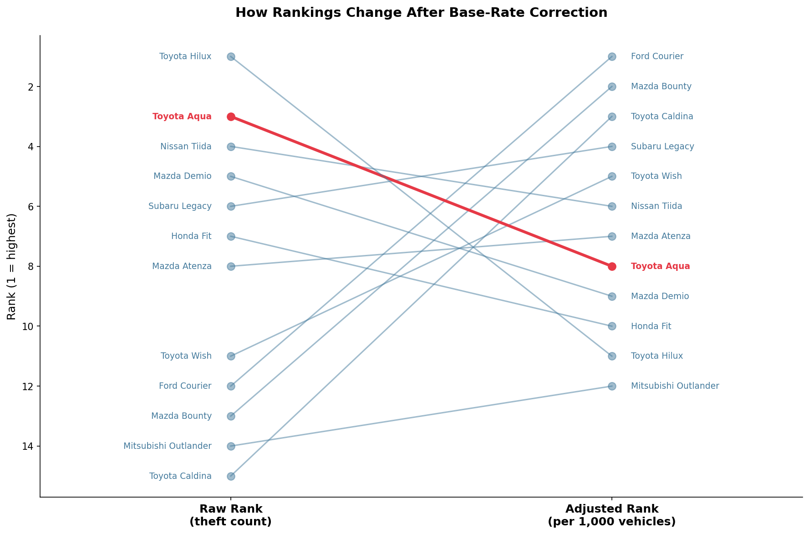

## 2. AMI Insurance Evidence

AMI's own data shows the Aqua's theft rate at 54 per 1,000 insured vehicles, compared to just 15 per 1,000 for the Corolla (the most insured model). This 3.6x disparity confirms that even within the insured population, the Aqua faces elevated risk.

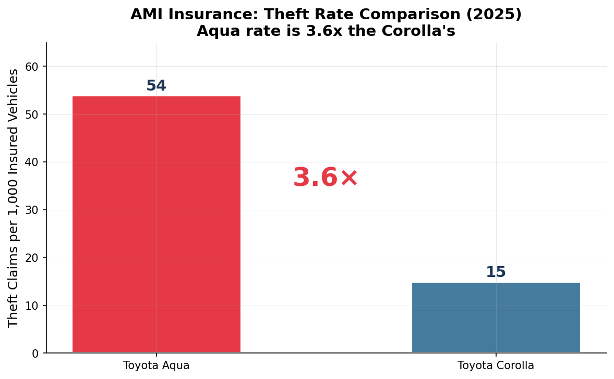

## 3. Fleet-Adjusted Theft Rates

Using police data normalised by total registered fleet:

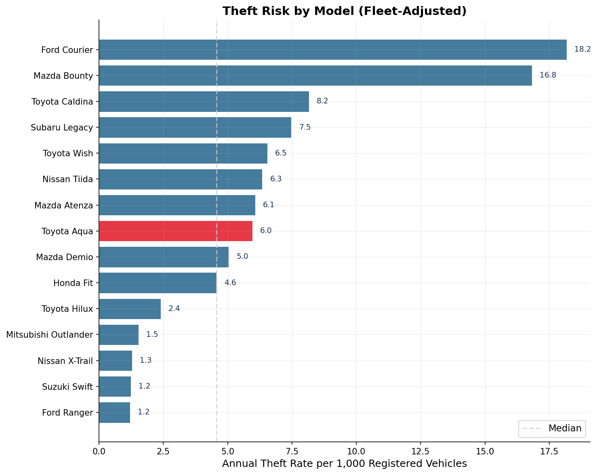

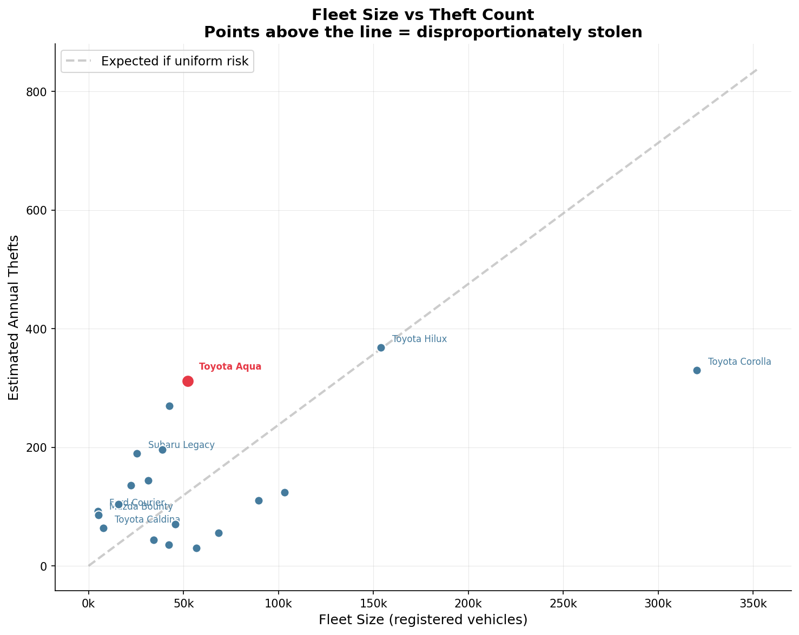

## 4. Confound Analysis

Theft rates are not solely about targeting. Structural factors including vehicle age, security features, parts market demand, and geographic concentration all contribute.

The composite vulnerability index correlates with theft rates at r = 0.625 (p = 0.0042), suggesting these factors 
explain a substantial portion of theft rate variation.

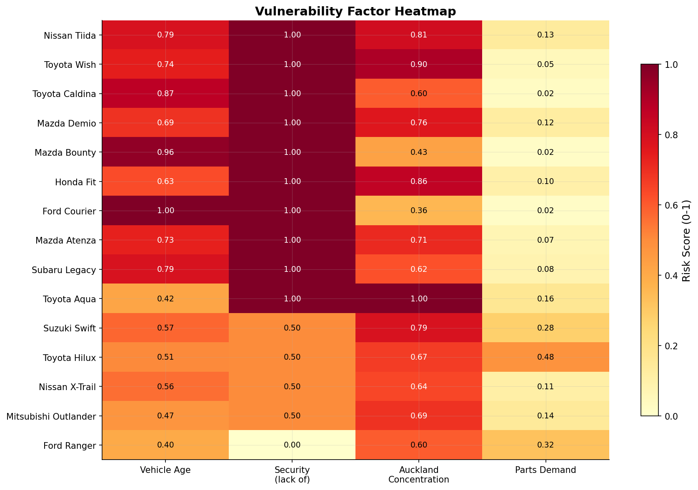

### Toyota Aqua Confound Profile

- **Age vulnerability**: 0.42
- **Security vulnerability**: 1.00
- **Auckland concentration**: 1.00
- **Parts demand**: 0.16
- **Residual targeting**: -0.97 per 1,000

## 5. Regional Breakdown: Auckland vs Canterbury

Theft risk varies dramatically by region. Auckland dominates for imported passenger cars, while Canterbury is the 'ute theft capital' of the South Island.

### Auckland vs Canterbury Theft Rates (per 1,000 vehicles)

| Model | Auckland | Canterbury | Higher In |
|-------|----------|------------|-----------|
| Mazda CX-5 | 0.6 | 0.5 | Auckland |
| Toyota Wish | 7.3 | 7.7 | Canterbury |
| Nissan Tiida | 7.2 | 8.0 | Canterbury |
| Mitsubishi Outlander | 1.8 | 2.0 | Canterbury |
| Mazda Demio | 5.6 | 6.3 | Canterbury |
| Suzuki Swift | 1.4 | 1.5 | Canterbury |
| Honda CRV | 0.9 | 1.1 | Canterbury |
| Toyota Corolla | 1.1 | 1.2 | Canterbury |
| Honda Fit | 4.9 | 5.9 | Canterbury |
| Nissan X-Trail | 1.5 | 1.8 | Canterbury |

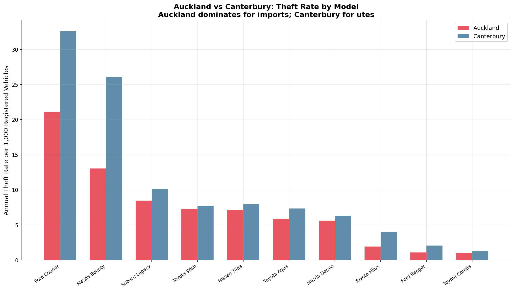

The Aqua's theft rate in Auckland (5.9/1,000) is 0.8x its Canterbury rate (7.4/1,000), reflecting Auckland's higher concentration of both Aquas and theft activity.

Conversely, the Hilux theft rate in Canterbury (4.0/1,000) exceeds Auckland (1.9/1,000), confirming Canterbury's status as NZ's ute theft hotspot.

## 6. Time Series: AMI Claims 2022-2025

AMI has published annual stolen vehicle reports since 2022, providing a four-year window to track the Aqua's risk trajectory.

### National Claims Trend

| Year | Total Claims | YoY Change |
|------|-------------|------------|
| 2022 | 8,492 | — |
| 2023 | 17,000 | +100% |
| 2024 | 12,000 | -29% |
| 2025 | 9,000 | -25% |

Claims peaked in 2023 during NZ's ram-raid crisis, then declined substantially as enforcement increased and ram-raid-related thefts dropped 50%.

### Toyota Aqua Trajectory

| Year | Claims | Share | Rank |
|------|--------|-------|------|
| 2022 | 934 | 11.0% | #1 |
| 2023 | 1,360 | 8.0% | #1 |
| 2024 | 960 | 8.0% | #1 |
| 2025 | 720 | 8.0% | #1 |

**Assessment**: Both absolute claims and claim share are declining. The Aqua's theft risk appears to be genuinely decreasing, likely driven by the overall crime decline and gradual fleet turnover to newer, more secure models.

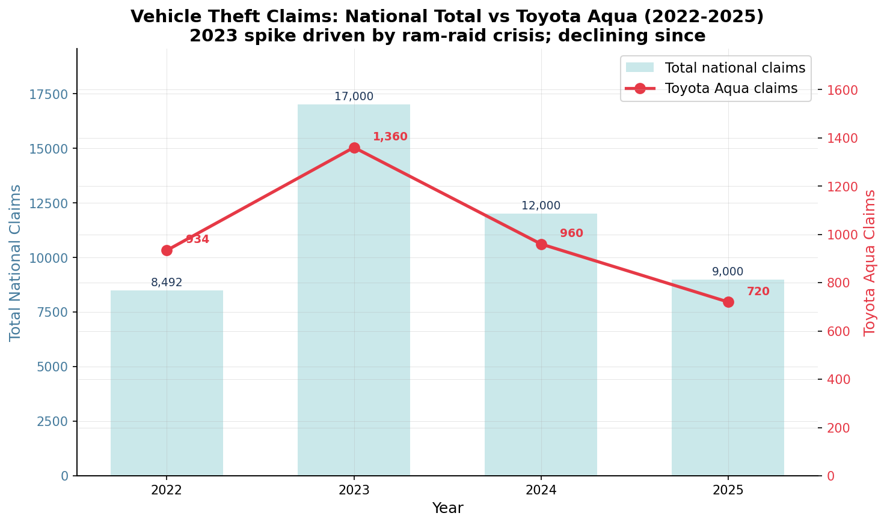

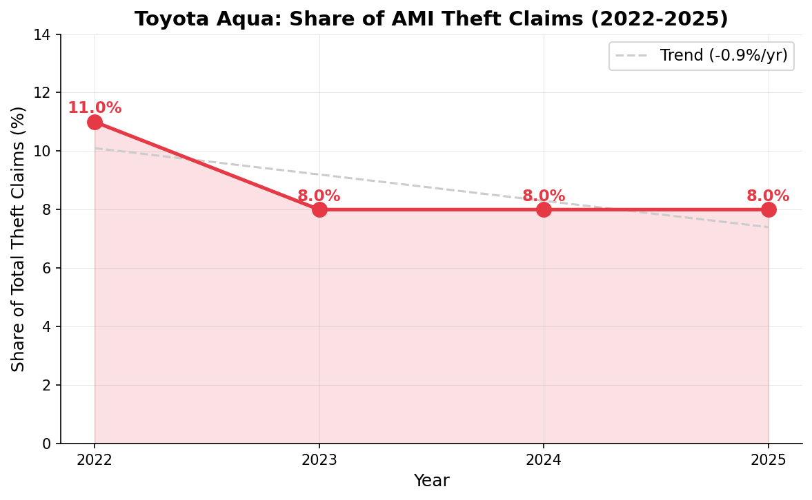

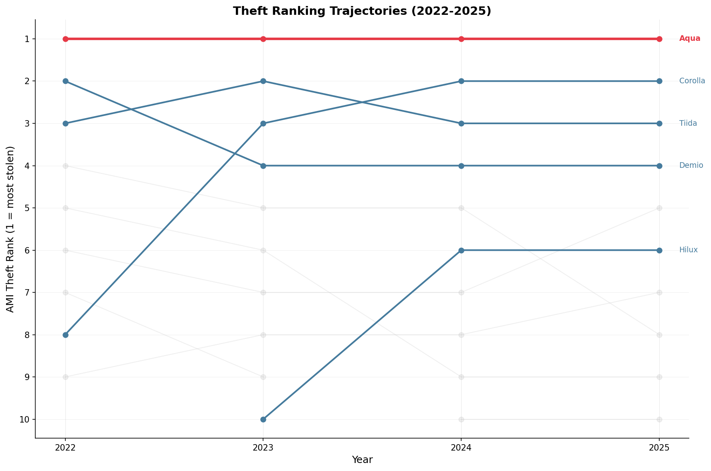

**Rising in rankings**: Toyota Corolla, Toyota Hilux, Subaru Impreza

**Falling in rankings**: Mazda Demio, Mazda Atenza, Toyota Mark X, Subaru Legacy

## 7. Forecast: Projected Rankings 2026-2027

Using the 2022-2025 claim-share trends, we can project which models are likely to rise or fall in future rankings. These projections use linear extrapolation of each model's share trajectory and a log-linear model for national claims (fitted to the post-peak decline). With only four years of data, these are indicative trends rather than precise forecasts.

### National Claims Outlook

- **2026**: ~6,483 claims (range: 5,933-7,083)
- **2027**: ~5,000 claims (range: 5,000-5,303)

The post-peak decline is projected to continue, with national claims converging toward pre-spike levels as ram-raid enforcement holds and the fleet gradually turns over.

### Projected Model Rankings

| Model | 2025 Rank | 2026 | 2027 | Outlook |
|-------|-----------|------|------|---------|
| Toyota Aqua | #1 | #2 | #2 | Persistent threat |
| Toyota Corolla | #2 | #1 | #1 | Accelerating threat |
| Nissan Tiida | #3 | #3 | #3 | Persistent threat |
| Mazda Demio | #4 | #6 | #9 | Declining gradually |
| Toyota Vitz | #5 | #5 | #5 | Persistent threat |
| Toyota Hilux | #6 | #4 | #4 | Accelerating threat |
| Subaru Impreza | #7 | #6 | #6 | Emerging threat |
| Mazda Atenza | #8 | #8 | #8 | Declining rapidly |
| Toyota Mark X | #9 | #11 | #11 | Declining rapidly |
| Subaru Legacy | #9 | #12 | #12 | Declining rapidly |
| Mazda Axela | #10 | #10 | #9 | Persistent threat |

### Key Projections

**Toyota Corolla projected to overtake the Aqua as most-stolen by 2026.** The Corolla's claim share has climbed steadily (+1.5 percentage points/year), driven by its massive and ageing fleet. Meanwhile, the Aqua's share is declining as newer models with encrypted immobilisers enter the fleet.

- **Toyota Corolla** (Accelerating threat): rank slope -1.9/yr
- **Toyota Hilux** (Accelerating threat): rank slope -2.0/yr
- **Subaru Impreza** (Emerging threat): rank slope -0.6/yr

- **Mazda Demio** (Declining gradually): ageing out of the at-risk fleet
- **Mazda Atenza** (Declining rapidly): ageing out of the at-risk fleet
- **Toyota Mark X** (Declining rapidly): ageing out of the at-risk fleet
- **Subaru Legacy** (Declining rapidly): ageing out of the at-risk fleet

*Caveat: Four-year series. External shocks — immobiliser mandates, scrappage schemes, economic shifts — could alter these trajectories substantially.*

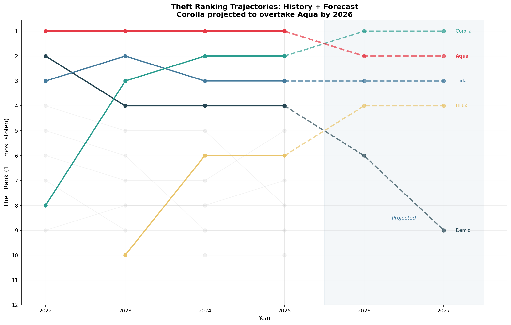

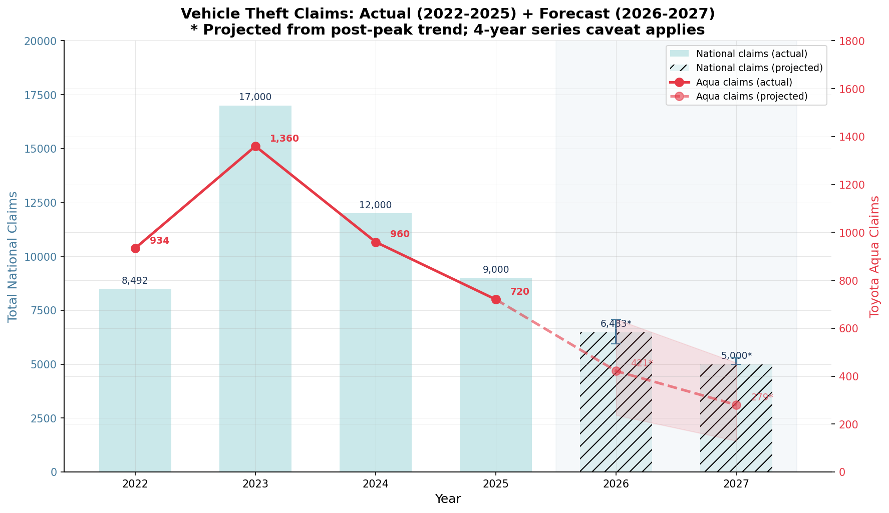

## 8. NZ Police Stolen Vehicle Records

The NZ Police Vehicle of Interest database provides row-level records of 4,500+ stolen vehicles (Oct 2021 – Apr 2022). Unlike insurance data, this captures all reported thefts regardless of insurance status.

### Top 10 Stolen Models (Police Data)

| Rank | Model | Thefts | % of Total | Median Age |
|------|-------|--------|-----------|------------|
| 1 | HILUX | 132 | 4.2% | 24 yr |
| 2 | COURIER | 132 | 4.2% | 18 yr |
| 3 | DEMIO | 94 | 3.0% | 17 yr |
| 4 | LEGACY | 88 | 2.8% | 19 yr |
| 5 | ATENZA | 79 | 2.5% | 17 yr |
| 6 | IMPREZA | 74 | 2.4% | 22 yr |
| 7 | TIIDA | 72 | 2.3% | 16 yr |
| 8 | HIACE | 68 | 2.2% | 22 yr |
| 9 | MARKX | 59 | 1.9% | 16 yr |
| 10 | NAVARA | 57 | 1.8% | 15 yr |

**Vehicle age**: 92.0% of stolen vehicles were over 10 years old (median age: 18.0 years). The Aqua, with a median theft age of 7.5 years, is notably younger than most targets.

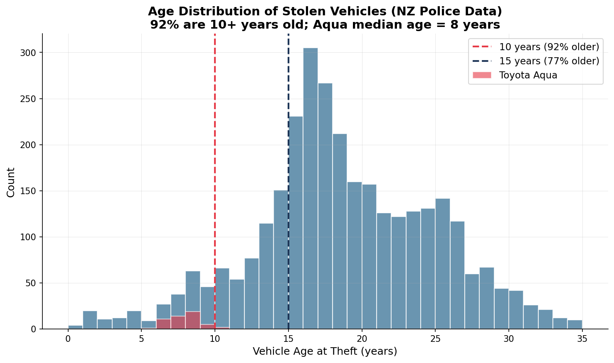

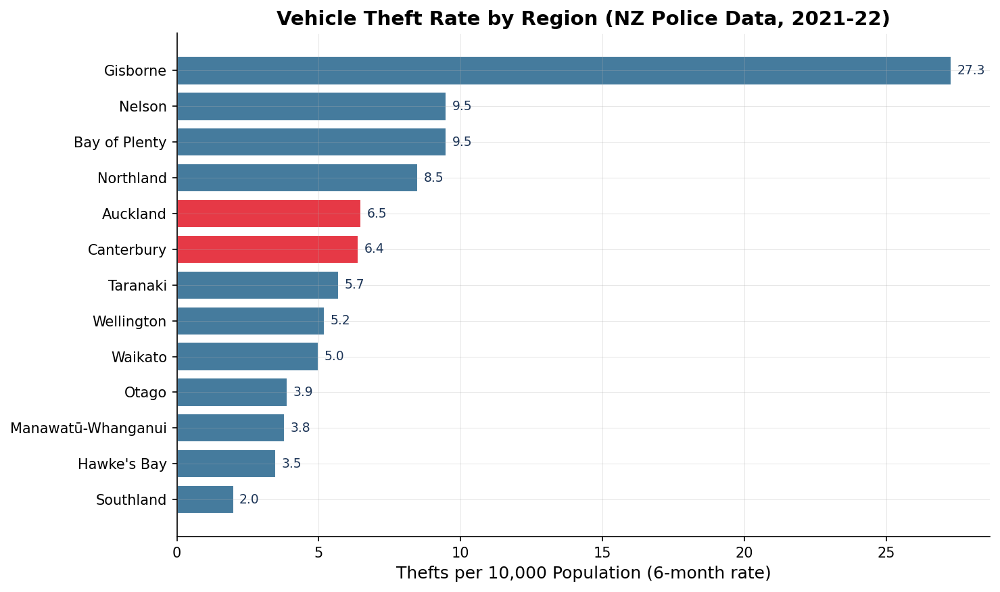

## 9. Cross-Source Validation

Do four independent data sources — AMI Insurance, AA Insurance, NZ Police records, and MoneyHub compiled statistics — tell the same story? Agreement across sources strengthens conclusions; divergence reveals source-specific biases.

### Ranking Comparison

| Model | AMI | AA | Police | MoneyHub | Avg Rank |
|-------|-----|-----|--------|----------|----------|
| Toyota Hilux | #6 | — | #1 | #1 | 2.7 |
| Mazda Demio | #4 | #2 | #3 | #5 | 3.5 |
| Nissan Tiida | #3 | #3 | #7 | #4 | 4.2 |
| Toyota Aqua | #1 | #1 | #13 | #3 | 4.5 |
| Toyota Corolla | #2 | #4 | #16 | #2 | 6.0 |
| Mazda Atenza | #5 | #7 | #5 | #8 | 6.2 |
| Subaru Legacy | — | #10 | #4 | #6 | 6.7 |
| Ford Courier | — | — | #2 | #12 | 7.0 |
| Subaru Impreza | #8 | #8 | #6 | — | 7.3 |
| Toyota Mark X | #9 | #6 | #9 | — | 8.0 |
| Mazda Bounty | — | — | #11 | #13 | 12.0 |
| Suzuki Swift | — | — | #17 | #10 | 13.5 |

### Source Correlations

- **AMI vs AA (both 2024)**: Spearman ρ = 0.786 (n=8, p=0.0208)
- **AMI vs Police (2024 vs 2021-22)**: Spearman ρ = 0.127 (n=10, p=0.7261)
- **AA vs Police (2024 vs 2021-22)**: Spearman ρ = -0.079 (n=10, p=0.8287)
- **AMI vs MoneyHub (2024 vs H2 2025)**: Spearman ρ = 0.086 (n=6, p=0.8717)

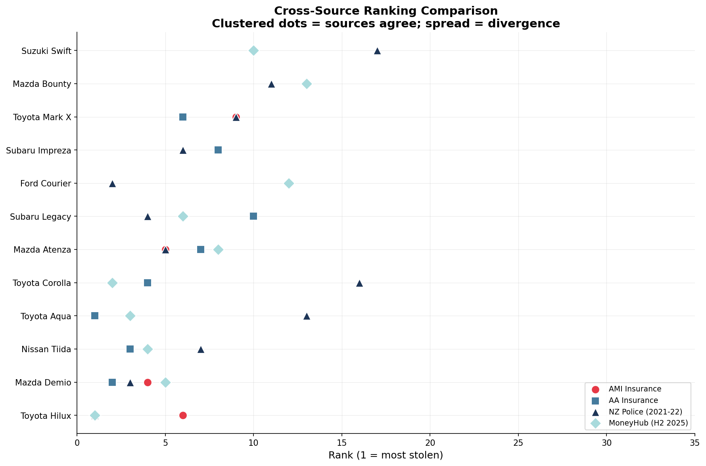

### Key Findings

- AGREEMENT: AMI and AA Insurance rankings are strongly correlated (Spearman ρ = 0.786, n = 8), despite covering different policyholder pools.

## 10. Socioeconomic Risk Factors: Beyond Vehicle Make

Vehicle theft is not solely a function of car model and security features. Area-level socioeconomic conditions shape theft rates independently of what people drive. Using NZ Police stolen vehicle records matched with Stats NZ regional indicators, we test which demographic factors predict where theft is concentrated.

*Methodology note: This is an ecological (area-level) analysis across 13 NZ regions. Correlations describe how theft rates vary with regional characteristics — they do not imply individual-level causation.*

### Bivariate Correlations with Theft Rate

| Indicator | Spearman ρ | p-value | Direction |
|-----------|-----------|---------|-----------|
| Density Km2 | +0.407 | 0.168 | moderate positive |
| Unemployment Rate | +0.390 | 0.188 | weak positive |
| Vehicles Per Capita | -0.341 | 0.255 | weak negative |
| Median Income | -0.203 | 0.505 | weak negative |
| Pct Rental | +0.203 | 0.505 | weak positive |
| Pct Urban | +0.176 | 0.566 | weak positive |
| Pct Under 25 | +0.088 | 0.775 | weak positive |
| Deprivation Index | +0.088 | 0.775 | weak positive |

No individual indicator reaches significance at p<0.05 with n=13 regions, but the directions are consistent: higher deprivation, unemployment, and population density are all associated with higher theft rates.

### Combined Model

The best 2-predictor model uses **deprivation index + pct urban** and explains 55% of the regional variance in theft rates (adjusted R² = 0.47, F-test p = 0.018). This is significant at the 5% level despite neither predictor reaching significance alone — they act as complementary predictors, with urbanisation suppressing noise in the deprivation signal.

### Regional Outliers

**More theft than socioeconomic factors predict:**

- **Gisborne**: actual 33.6 vs predicted 24.4 per 10,000
- **Nelson**: actual 16.9 vs predicted 9.7 per 10,000

**Less theft than socioeconomic factors predict:**

- **Hawke's Bay**: actual 5.5 vs predicted 13.3 per 10,000
- **Manawatū-Whanganui**: actual 5.4 vs predicted 12.9 per 10,000

Gisborne's large positive residual suggests factors beyond deprivation and urbanisation — possibly its small population (where a handful of prolific offenders can shift per-capita rates substantially), geographic isolation, or local enforcement patterns.

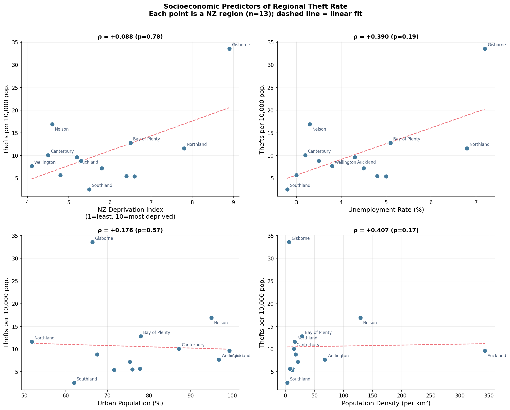

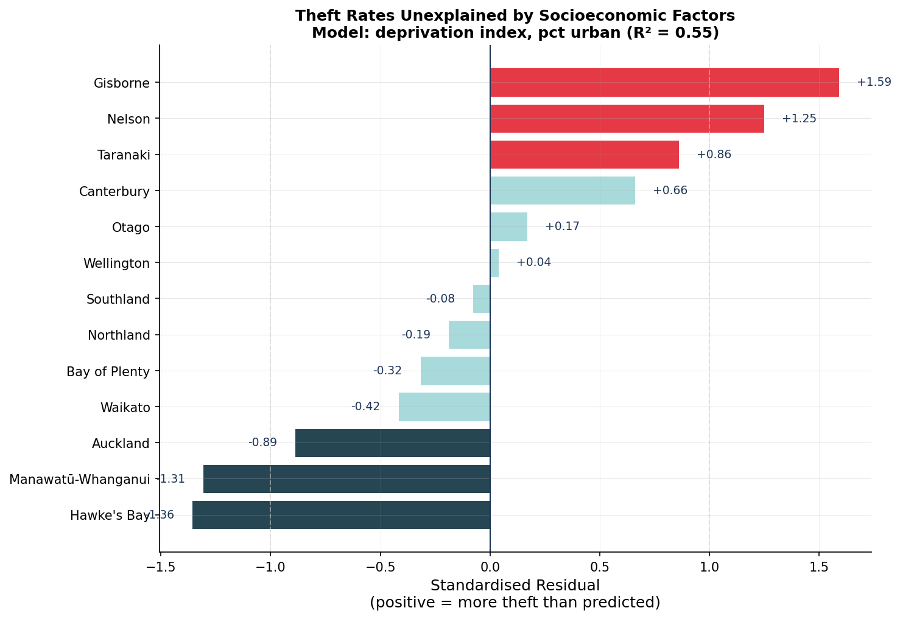

### Implications for Insurance and Policy

Vehicle theft risk is a function of at least three layers:

1. **Vehicle factors** — model, age, security features, parts demand (analysed in sections 1-4)
2. **Geographic factors** — regional theft culture, enforcement intensity, urban density (section 5)
3. **Socioeconomic factors** — deprivation, unemployment, housing tenure (this section)

Insurance pricing that considers only vehicle model misses the second and third layers. An Aqua in low-deprivation Southland (2.5 thefts per 10,000) faces a fundamentally different risk profile from one in high-deprivation Gisborne (33.6 per 10,000). Postcode-level risk adjustment — already standard in many markets — would better reflect this reality.

## 11. Conclusion

The claim that the Toyota Aqua is NZ's most theft-prone car is **partially true but requires context**:

1. **True**: The Aqua is stolen at rates well above what its fleet size alone predicts. The base-rate fallacy does not fully explain the headline.

2. **Misleading**: By per-vehicle risk, older utility vehicles (Ford Courier, Mazda Bounty) face higher theft odds. Framing the Aqua as the 'most stolen' without this context overstates its relative risk.

3. **Regional**: The Aqua's risk is concentrated in Auckland. In Canterbury, utes like the Hilux and Courier face higher per-vehicle theft rates. National statistics mask these regional patterns.

4. **Trending down**: Absolute Aqua theft claims have declined 47% from the 2023 peak, tracking the overall national decline. The Aqua's share of claims has shifted from 11.0% to 8.0%.

5. **Forecast**: If current trends hold, the Toyota Corolla is projected to overtake the Aqua as the most-stolen model by 2026, driven by its larger, ageing fleet. The Hilux is also rising, while older Mazda models are declining.

6. **Socioeconomic context**: Regional deprivation and urbanisation together explain 55% of the variance in per-capita theft rates. Vehicle model alone is an incomplete risk picture — where the car is parked matters as much as what it is.

7. **Structural**: The Aqua's vulnerability is largely explained by its age profile, lack of encrypted immobilisers in early models, high Auckland concentration, and robust parts demand. These are fixable factors, not inherent model defects.

## Data Sources

- AMI Insurance, 2025 Top 10 Stolen Cars (Feb 2026)
- MoneyHub, NZ Police theft data, Jun-Dec 2025
- NZTA Waka Kotahi, Motor Vehicle Register
- CarJam fleet registration data
- Stats NZ Census 2018 / Household Labour Force Survey 2023
- NZ Deprivation Index (NZDep2018)
